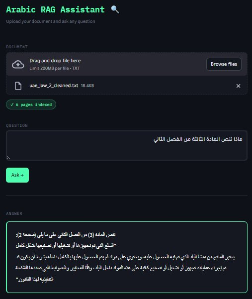

# 📜 Arabic Legal Document Processing Pipeline

A modular, end-to-end pipeline for extracting, splitting, profiling, and structuring Arabic legal documents (UAE laws) from PDFs or web sources into structured JSON — with a RAG-powered question answering interface.

---

## 🗂️ Project Overview

```
PDFs / Web
    │
    ▼
[1] PDF Text Extraction   ──► pymupdff.py  (PyMuPDF — native text)
                          ──► doclingg.py  (Docling — OCR for scanned PDFs)
    │
    ▼
[2] Web Scraping (optional) ──► scrap.py   (crawl4ai + BeautifulSoup)
    │
    ▼
[3] Page Splitting        ──► split.py     (logical pages + preamble detection)
    │
    ▼
[4] Document Profiling
    ├── regexx.py         (Regex-only — fast, deterministic)
    └── hybrid.py         (Regex + Gemini AI — fills metadata gaps)
    │
    ▼
[5] RAG Interface         ──► app.py + rag.py  (Streamlit + FAISS + Gemini)
    │
    ▼
Structured JSON outputs + Grounded Arabic Q&A
```

---

## 📁 Repository Structure

```
.
├── PDFs/                        # Input PDF files
├── Clean_Text/                  # Raw scraped/extracted text
├── Splits/                      # Logically split .txt files
├── PyMuPDF Output/              # Markdown output from PyMuPDF
├── Docling Output/              # Markdown output from Docling (OCR)
├── Regex Only Output/           # JSON outputs from regex profiler
├── Hybrid Output (AI & Regex)/  # JSON outputs from hybrid profiler
│
├── pymupdff.py                  # PDF → Markdown (native text layer)
├── doclingg.py                  # PDF → Markdown (OCR via Docling + EasyOCR)
├── scrap.py                     # Web scraper for uaelegislation.gov.ae
├── split.py                     # Splits cleaned text into logical pages
├── regexx.py                    # Regex-only document profiler
├── hybrid.py                    # Hybrid profiler (Regex + Gemini AI)
├── rag.py                       # RAG backend (embeddings, FAISS, retrieval, generation)
└── app.py                       # Streamlit frontend
```

---

## ⚙️ Setup & Installation

### Prerequisites

- Python 3.10+
- pip

### Install Dependencies

```bash
pip install pymupdf docling crawl4ai beautifulsoup4 google-generativeai \
            streamlit faiss-cpu sentence-transformers numpy
```

For `crawl4ai` browser support:

```bash
playwright install
```

---

## 🚀 Usage

### Step 1 — Extract Text from PDFs

**Option A: PyMuPDF** (fast, works on PDFs with a native text layer)

```bash
python pymupdff.py
```

> Reads from `PDFs/`, outputs `.md` files to `PyMuPDF Output/`

**Option B: Docling + EasyOCR** (for scanned/image-based Arabic PDFs)

```bash
python doclingg.py
```

> Reads from `PDFs/`, outputs `.md` files to `Docling Output/`

---

### Step 2 — Scrape Laws from the Web (optional)

```bash
python scrap.py
```

> Fetches laws from `uaelegislation.gov.ae` and saves cleaned text to `Clean_Text/`

---

### Step 3 — Split into Logical Pages

```bash
python split.py
```

> Reads `.txt` files from `Clean_Text/`, splits them at structural markers (الباب / الفصل / المادة), and saves paged `.txt` + metadata `.json` to `Splits/`

---

### Step 4 — Profile & Structure Documents

**Option A: Regex-only** (no API key required, deterministic)

```bash
python regexx.py
```

**Option B: Hybrid (Regex + Gemini AI)** (richer metadata, AI-corrected counts)

1. Set your Gemini API key in `hybrid.py`:
   ```python
   GEMINI_API_KEY = "your-api-key-here"
   ```
2. Run:
   ```bash
   python hybrid.py
   ```

> Both profilers read from `Splits/` and output `*_metadata.json` + `*_structure.json` per document.

---

### Step 5 — RAG Question Answering Interface

```bash
streamlit run app.py
```

Upload any page-structured `.txt` file from `Splits/`, type your question in Arabic, and get a grounded answer.

---

## 🤖 RAG Interface

The RAG system lets you query any processed legal document with natural language Arabic questions. It embeds the document pages into a FAISS vector index and uses Gemini to generate grounded answers from the most relevant retrieved pages.



*Example: querying المادة الثالثة من الفصل الثاني — the system retrieves the correct page and generates an accurate Arabic answer with a page reference.*

### How it works

```
User Question
     │
     ▼
[Embedding]  query: <question>  →  BGE vector
     │
     ▼
[FAISS Search]  top-k most similar page chunks
     │
     ▼
[Gemini Prompt]  context (retrieved pages) + question
     │
     ▼
Grounded Arabic Answer
```

### Components

| File | Role |
|---|---|
| `rag.py` | Chunking, FAISS indexing, retrieval, Gemini generation |
| `app.py` | Streamlit UI — file upload, question input, answer display |

---

## 💡 Model Recommendations for Arabic Documents

The models currently used (`BAAI/bge-base-en-v1.5` for embeddings, `gemini-2.5-flash` for generation) are **free and readily available**, making them a solid practical starting point. For better Arabic-specific performance, here are the best free alternatives:

### Embedding Models

| Model | Source | Why better for Arabic |
|---|---|---|
| ✅ `BAAI/bge-base-en-v1.5` *(current)* | HuggingFace | Good baseline — but English-first |
| ⭐ `text-embedding-3-large` | Openai | most powerful and versatile embedding model, offering high-dimensional semantic representation and superior multilingual performance—particularly for complex languages like Arabic |

> **Recommendation:** Swap `BAAI/bge-base-en-v1.5` for `text-embedding-3-large` in `rag.py` for the best free Arabic retrieval. It's a one-line change — just replace the model name string.

### Generation (LLM) Models

| Model | Source | Why better for Arabic |
|---|---|---|
| ✅ `gemini-2.5-flash` *(current)* | Google (free tier) | Fast, multilingual, good Arabic comprehension |
| ⭐ `GPT-4o` | Openai | Serves as the high-performance synthesis engine that leverages an optimized Arabic tokenizer to "read" retrieved context more efficiently and "generate" linguistically nuanced, grounded responses across both Modern Standard Arabic and regional dialects. |

> **Recommendation:** `gemini-2.5-flash` is a great free default for Arabic legal text. Upgrade to `GPT-4o` if you need deeper reasoning on long documents or multi-article questions.

---

## 📤 Output Schema

Each processed document produces two JSON files:

### `*_metadata.json`

| Field | Description |
|---|---|
| `document_id` | UUID for the document |
| `title` | Law subject (extracted from بشأن clause) |
| `law_number` | Official reference number |
| `document_type` | e.g. Federal Law, Decree-Law |
| `jurisdiction` | e.g. UAE |
| `language` | Arabic |
| `effective_date` | YYYY-MM-DD |
| `status` | e.g. in_force |

### `*_structure.json`

| Field | Description |
|---|---|
| `total_nodes` | Total structural units found |
| `parts_extracted` | Count of أبواب (Parts) |
| `chapters_extracted` | Count of فصول (Chapters) |
| `articles_extracted` | Count of مواد (Articles) |
| `has_preamble` | Boolean |
| `hierarchy` | Ordered structural layers |
| `structural_vocabulary` | Patterns found with regex and counts |

---

## 🧩 Supported Document Structures

| Arabic | English | Level |
|---|---|---|
| الباب | Part | 1 |
| الفصل | Chapter | 2 |
| المادة | Article | 3 |

---

## 🔐 API Keys

Keep API keys out of version control. Use environment variables instead of hardcoding:

```python
import os
GEMINI_API_KEY = os.environ.get("GEMINI_API_KEY")
```

Add a `.env` file locally and load it with `python-dotenv`, or export in your shell:

```bash
export GEMINI_API_KEY="your-key-here"
```

---

## ⚠️ Notes

- Docling OCR can be slow on large PDFs without a GPU. Set `use_gpu=True` in `doclingg.py` if a CUDA GPU is available.
- `pymupdff.py` will warn if a PDF has no native text layer — use Docling instead for those.
- The RAG interface expects `.txt` files with `=== صفحة X ===` page markers produced by `split.py`.
